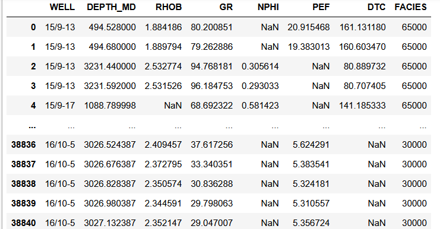

# Rapport : Clustering non supervisé sur les données de diagraphie de puits

## Introduction

Dans ce tutoriel, nous allons effectuer un apprentissage non supervisé en utilisant deux méthodes de clustering :

- **K-Means Clustering**
- **Gaussian Mixture Modelling (GMM)**

Nous comparerons ensuite les résultats obtenus avec une courbe de lithofaciés établie.

## Clustering

Le clustering est une méthode d'analyse exploratoire qui regroupe des points de données selon leurs similarités, sans supervision préalable. Cette méthode permet d'organiser et d'interpréter des données, bien que la pertinence des groupes dépende des connaissances du domaine.

### Hypothèse de clustering

L'hypothèse sous-jacente est que les points de données se comportent de manière similaire par rapport aux besoins d'information.

## Méthodes de clustering

### K-Means Clustering

L'algorithme **K-Means** est l'un des plus courants en apprentissage non supervisé. Il regroupe les données en **K clusters** en minimisant la distance entre chaque point de donnée et son centroïde.

- Itération :
  1. Placement aléatoire des centroïdes.
  2. Assignation des points au centroïde le plus proche.
  3. Recalcul des centroïdes.
  4. Répétition jusqu'à convergence.

K-Means est un clustering **dur** (chaque point appartient à un seul cluster) et peut gérer des données numériques et catégoriques.

### Gaussian Mixture Modelling (GMM)

Le modèle **GMM** est une alternative fondée sur la variance des données. Contrairement à K-Means, il effectue un clustering **souple** en attribuant à chaque point une probabilité d'appartenance à chaque cluster.

- K-Means fonctionne mieux pour des clusters circulaires.
- GMM est plus flexible et peut gérer des formes elliptiques, mais peut ne pas converger facilement.

## Jeu de données

Le jeu de données utilisé provient d'une compétition de Machine Learning organisée par **Xeek et FORCE 2020** ([Zenodo](https://doi.org/10.5281/zenodo.4351155)). Il contient des mesures issues de **118 puits** de la mer de Norvège.

Les colonnes utilisées sont :
- **GR** : Gamma Ray
- **RHOB** : Densité en vrac
- **NPHI** : Porosité neutronique
- **DTC** : Lenteur acoustique compressive

## Importation des bibliothèques et chargement des données

```python
import pandas as pd
import matplotlib.pyplot as plt
import seaborn as sns
import numpy as np
import matplotlib.colors as colors

# Chargement des données
df = pd.read_csv("../../data/xeek_train_subset_mini.csv")
```

## Exploration et préparation des données

```python
# Sélection des colonnes d'intérêt
workingdf = df[["WELL", "DEPTH_MD", "RHOB", "GR", "NPHI", "PEF", "DTC", "FORCE_2020_LITHOFACIES_LITHOLOGY"]].copy()

# Renommage
df.rename(columns={'FORCE_2020_LITHOFACIES_LITHOLOGY': 'FACIES'}, inplace=True)

# Visualisation du Dataframe
workingdf

```


## Visualisation des données

```python
g = sns.FacetGrid(workingdf, col='LITH', col_wrap=3)
g.map(sns.scatterplot, 'NPHI', 'RHOB', alpha=0.5)
g.set(xlim=(-0.15, 1))
g.set(ylim=(3, 1))
plt.show()
```

## Optimisation du nombre de clusters

```python
from sklearn.cluster import KMeans

def optimise_k_means(data, max_k):
    means = []
    inertias = []
    
    for k in range(1, max_k):
        kmeans = KMeans(n_clusters=k)
        kmeans.fit(data)
        means.append(k)
        inertias.append(kmeans.inertia_)
    
    plt.plot(means, inertias, 'o-')
    plt.xlabel("Nombre de Clusters")
    plt.ylabel("Inertie")
    plt.grid(True)
    plt.show()

optimise_k_means(workingdf[['GR', 'RHOB', 'NPHI', 'DTC']], 16)
```

L'inertie diminue avec le nombre de clusters, sans point de rupture clair. On choisit **5 clusters** pour notre analyse.

## Application des modèles de clustering

### K-Means

```python
kmeans = KMeans(n_clusters=5)
kmeans.fit(workingdf[['GR', 'RHOB', 'NPHI', 'DTC']])
workingdf['KMeans'] = kmeans.labels_
```

### Gaussian Mixture Model

```python
from sklearn.mixture import GaussianMixture

gmm = GaussianMixture(n_components=5)
gmm.fit(workingdf[['GR', 'RHOB', 'NPHI', 'DTC']])
workingdf['GMM'] = gmm.predict(workingdf[['GR', 'RHOB', 'NPHI', 'DTC']])
```

## Visualisation des résultats

```python
fig, ax = plt.subplots(figsize=(20,10))
ax.remove()
ax1 = plt.subplot2grid((1,3), (0,0))
ax2 = plt.subplot2grid((1,3), (0,1))
ax3 = plt.subplot2grid((1,3), (0,2))

for ax, title in zip([ax1, ax2, ax3], ['KMeans', 'GMM', 'FACIES']):
    ax.scatter(workingdf['NPHI'], workingdf['RHOB'], c=workingdf[title], s=8)
    ax.set_title(title)
plt.show()
```

## Conclusion

Nous avons appliqué **K-Means** et **GMM** sur des données de diagraphie de puits.
- **K-Means** produit des clusters bien définis mais rigides.
- **GMM** offre une classification plus souple mais moins stable.

L'évaluation des clusters doit être complétée par des connaissances géologiques et des post-traitements pour correspondre à des facies connus.

